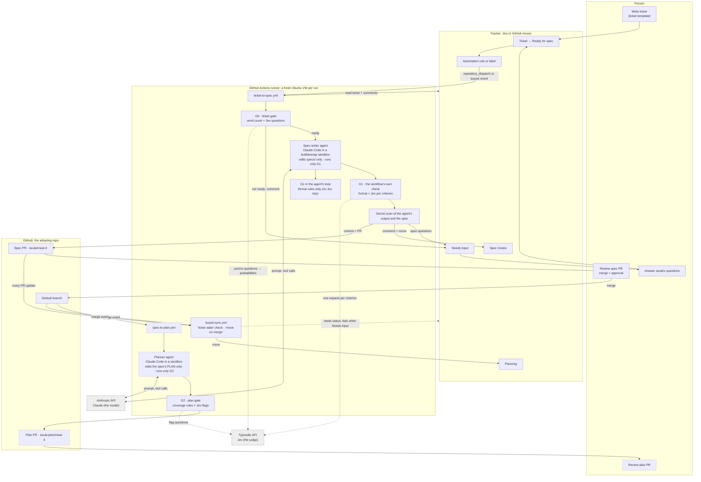

# How seula works, and how to use it

seula turns a tracker ticket into an agreed spec, and then into a plan, with quality gates
between the steps. Agents do the writing; gates check the work; people approve it. This page
shows the flow, what runs where, how it is secured, and how a team uses it day to day.

Steps marked 🔜 belong to the plan step
([`../specs/spec-to-plan-workflow.md`](../specs/spec-to-plan-workflow.md)). Its gate (G2) and
its prompt are built; its workflow is not built yet.

## The flow

Solid boxes run today. Dashed boxes are the plan step. Grey boxes are services outside GitHub.



## What runs where

| Part | Where it runs | What it is |
|---|---|---|
| Ticket, statuses, automation rule | The tracker (Jira Cloud or GitHub Issues) | Holds the work's state, and starts a run |
| `ticket-to-spec.yml`, `spec-check.yml`, `board-sync.yml`, 🔜 `spec-to-plan.yml` | GitHub Actions, a fresh Ubuntu VM per run | seula's reusable workflows. The adopting repo calls them from short caller workflows, pinned to a seula version |
| G0, G1, G2 | The same runner, as `seula gate` commands | Rules, then questions to Jev. seula's code turns Jev's answers into pass, back or unsure |
| Spec writer, 🔜 planner | The same runner: Claude Code, in a sandbox | The only agents. Their loop runs on the runner; the model runs at Anthropic |
| Jev | Typesafe's API | A judge, not an agent. It answers fixed yes/no questions with a probability, and has no tools |
| Your machine | Nothing is required | The Claude Code plugin is optional, for running the gates yourself |

## How it is secured

**The agent is boxed in** ([ticket-to-spec](../specs/ticket-to-spec-workflow.md) criteria 5,
6 and 14):
- It can edit only files in the spec directory. The planner can edit only its one spec file.
- Its only command is `seula gate g1` (or `g2`). It has no git, and no web fetch or search.
- It can read only the checkout and its installed skills.
- Every command runs in a bubblewrap sandbox with no network, and can't see the Anthropic key.
- The repo's own `.claude/` settings, hooks and skills don't load, so they can't widen these
  limits. Claude Code is installed at an exact version.

**Secrets reach only the steps that use them:**
- The agent gets no GitHub, Jira or Jev key. No token is on disk while it runs.
- Caller workflows pass secrets by name, never `secrets: inherit`. seula's API keys have their
  own names (`SEULA_ANTHROPIC_API_KEY`), so seula never spends a key the app uses.
- Board sync gets only the tracker's credentials.
- The agent's output and the spec are scanned for secret values before anything is committed or
  posted.
- A refused credential exits 77 and names the secret, never its value.

**Ticket text is data:**
- Ticket text reaches the gates and the agent only as a file, never inside a shell script.
- The prompts tell the agent not to obey text in the ticket.
- G0 asks Jev whether the ticket contains text aimed at an AI, and stops for a person when it
  does.
- seula's own comments are labelled, but the label gives them no trust.

**People keep the decisions:**
- An agent never sets a spec to *Approved*. Merging the spec pull request is the approval, and
  only a person merges.
- The `seula / ticket state` check blocks merging a spec whose ticket needs input, once the repo
  requires it.
- Loops are bounded: after two backs from one gate, the work stops for a person. "Unsure"
  always goes to a person.
- G2 checks that the planner changed nothing but `## PLAN`, and the planner may not change a plan
  only to avoid a flag.

**The workflows are hard to tamper with:**
- Actions are pinned to commit SHAs, and adopting repos pin seula to a commit.
- Board sync reads the config from the base branch, so a pull request can't rename the state it
  is checked against.
- Branch names are passed only as data, and ticket keys are checked before any tracker call.
- Pull requests from forks are skipped.
- seula has no runtime dependencies.

The rest of the security bar (dependency and secret scanning, a network allowlist, a threat
model) is in [`../specs/security.md`](../specs/security.md).

## Set it up (once per repo)

The full steps are in the setup guide for your tracker: [Jira](setup-jira.md) or
[GitHub Issues](setup-github-issues.md). In short:

1. **Run `init`** in the repo's root, with a full commit SHA of seula (there is no release
   yet), then merge the files it writes to the default branch:

   ```bash
   git ls-remote https://github.com/JJJohansson/seula main    # the latest commit SHA
   npx github:JJJohansson/seula init --tracker jira --seula-ref <commit SHA>    # or --tracker github
   ```

2. **Create the tokens:** a dispatch token for the Jira rule (Jira only), a seula bot token
   that pushes branches and opens pull requests, and a Jira API token (Jira only).
3. **Add the repository secrets** that `init` lists: `SEULA_ANTHROPIC_API_KEY`,
   `SEULA_GH_TOKEN`, optional `SEULA_TYPESAFE_API_KEY`, and for Jira `JIRA_BASE_URL`,
   `JIRA_EMAIL` and `JIRA_API_TOKEN`.
4. **Set up the board.** Jira: the statuses Ready for spec → Needs input → Spec review →
   Planning → Code review → Done, and the automation rule. GitHub Issues: the label
   `seula:ready-for-spec`.
5. **Turn on board sync:** set `tracker.states.planning`, and require the check
   `seula / ticket state` in a ruleset after it has run once.
6. **Test it** with one clear ticket and one ticket that has only a title.

## Use it, ticket by ticket

| # | You do | seula does | You see |
|---|---|---|---|
| 1 | Write the ticket from the template: who and why, what should change, what is not needed now | — | — |
| 2 | Move it to **Ready for spec** (GitHub: add the label) | The tracker starts `ticket-to-spec` on a fresh runner | A run in the Actions tab |
| 3 | — | Reads the ticket and its comments, then runs **G0**: long enough, clear about what must change, no contradictions, no text aimed at an AI? About a minute, and no Claude cost | — |
| 3a | *If G0 says no* | Posts its questions, and moves the ticket to **Needs input** | A `seula · ` comment |
| 3b | Answer in a comment, then move the ticket to **Ready for spec** again | Starts again at step 2 and reads your answer | — |
| 4 | — | The **spec writer** writes one spec in the spec directory. It checks the format with G1 and writes down what it can't answer as open questions | — |
| 5 | — | Runs **G1 with Jev** on every criterion (testable, unambiguous, about behavior, in scope), then the secret scan | — |
| 6 | — | Commits to `seula/<ticket>`, opens or updates **one pull request per ticket**, comments on the ticket, and moves it | The spec pull request, with each gate result and the cost |
| 6a | *If there are questions, or G1 sent the spec back* | The pull request is a draft, the ticket goes to **Needs input**, and the ticket state check is red | Answer, and move the ticket to Ready for spec: the same pull request is updated |
| 6b | *If the spec is ready* | The pull request is ready for review, and the ticket goes to **Spec review**. Criteria that Jev was unsure about are under "Needs your judgement" | — |
| 7 | **Review the spec**, and edit it if needed | `spec-check` runs the format rules on your edits | Checks on the pull request |
| 8 | **Merge it.** Merging approves the spec | Board sync moves the ticket to **Planning** | The ticket in Planning |
| 9 🔜 | — | `spec-to-plan` sets the spec to *Approved*. The **planner** reads the code and writes `## PLAN`: a task, a test and files for every criterion. **G2** checks the coverage, and Jev flags sign-in, stored data or personal data | A plan pull request on `seula-plan/<ticket>`, and a comment on the ticket |
| 10 🔜 | **Review and merge the plan** | — | — |
| 11 | Build the feature, open a pull request, review it and merge it | Build, review and deploy gates (G3 to G5) are planned | — |

A run takes 2 to 4 minutes. The spec writer costs about $0.60 to $1.20 of Claude per run;
Jev costs a fraction of a cent.

## When something goes wrong

- **The ticket moved, but no run started:** open the Jira rule's audit log. A 401 usually
  means that the dispatch token expired.
- **A "seula failed to run" comment** names the step that failed and links the run. Find the
  step in [troubleshooting](troubleshooting.md).
- **Exit 77** anywhere means that a service refused a credential. The message names the
  secret to replace.
- **The ticket state check stays red after you moved the ticket by hand:** re-run the check
  from the pull request page.

## Work locally (optional)

- Install the plugin in Claude Code: `/plugin marketplace add JJJohansson/seula`, then
  `/plugin install seula@seula`. The `seula-gates` skill tells your agent which gate to run
  after each step.
- Run the gates yourself: `seula gate g0 --ticket ticket.md`, `seula gate g1 spec.md`,
  `seula gate g2 spec.md`. Add `--run <id>` to record the result.
- `seula status` shows every feature, its step, and who it is waiting on.

The gates, their questions and their exit codes are described in
[quality gates](quality-gates.md).
